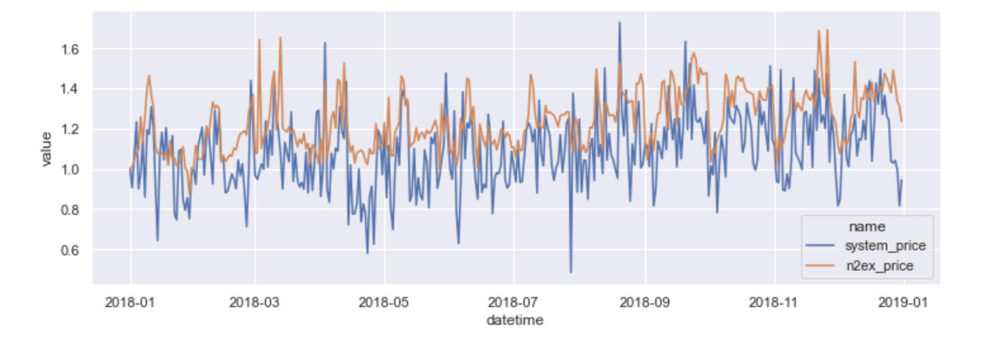

## Origami ML

Utilities to analyse energy market time-series data.

To install requirements:
```text
pip install -r requirements.txt
```

For seasonality investigation, see `part_1_seasonality.ipynb`.

For model evaluation, see `part_2_modelling.ipynb`.


